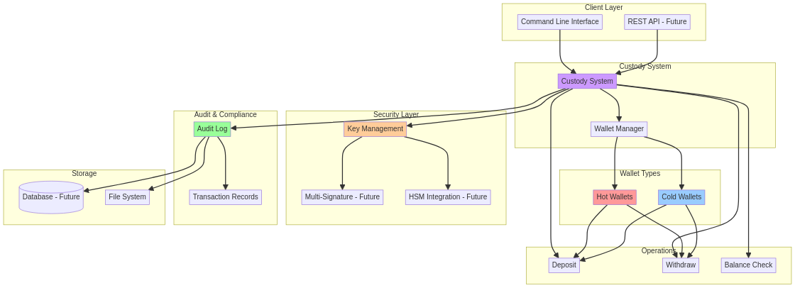
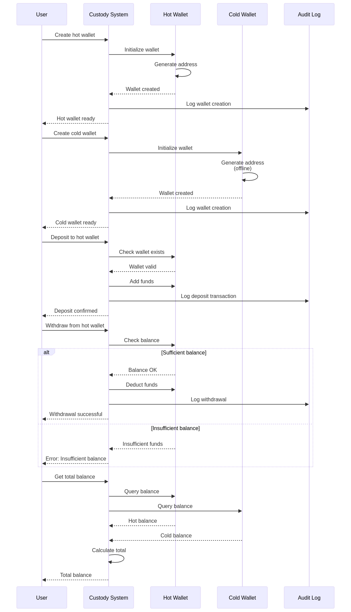

# 🔐 SecureVault - Cryptocurrency Custody System

[](https://github.com/galafis/securevault/actions)
[](https://codecov.io/gh/galafis/securevault)
[](https://www.rust-lang.org/)
[](./LICENSE)
[]()

[English](#english) | [Português](#português)

---

## English

### 🚀 Overview

**SecureVault** is an enterprise-grade cryptocurrency custody system built in Rust, designed for secure storage and management of digital assets. It features multi-signature wallets, hot/cold wallet separation, and comprehensive audit trails.

### ✨ Key Features

- **Multi-Signature Wallets**: Require multiple approvals for transactions
- **Hot/Cold Wallet Separation**: Segregate operational and storage funds
- **Secure Key Management**: Hardware Security Module (HSM) integration ready
- **Audit Trail**: Complete transaction history and compliance reporting
- **Type-Safe Operations**: Leverages Rust's safety guarantees
- **Real-Time Balance Tracking**: Monitor all wallet balances instantly

### 🛠️ Installation

```bash
git clone https://github.com/galafis/securevault.git
cd securevault
cargo build --release
```

### 🎯 Quick Start

```bash
cargo run --release
```

Output:
```
🔐 SecureVault - Cryptocurrency Custody System
==============================================

✓ Created hot wallet: hot_001 (0x1234567890abcdef)
✓ Created cold wallet: cold_001 (0xfedcba0987654321)

✓ Deposited 10.5 BTC to hot wallet
✓ Deposited 100.0 BTC to cold wallet

📊 Wallet Balances:
  hot_001 (Hot): 10.5 BTC
  cold_001 (Cold): 100 BTC

💰 Total Balance: 110.5 BTC

✓ Withdrew 5.0 BTC from hot wallet

📊 Final Total Balance: 105.5 BTC

🔄 Transferring 2.0 BTC from hot to cold wallet...
✓ Transfer successful

📊 Final Wallet Balances:
  hot_001 (Hot): 3.5 BTC
  cold_001 (Cold): 102 BTC

📜 Transaction History for hot_001:
  1. Deposit: 10.5 BTC
  2. Withdrawal: 5 BTC
  3. Withdrawal: 2 BTC
```

### 📚 Usage Examples

#### Basic Wallet Operations

```rust
use securevault::{CustodySystem, WalletType};

fn main() {
    let mut system = CustodySystem::new();

    // Create hot wallet for daily operations
    let hot_wallet = system.create_wallet(
        "hot_001".to_string(),
        "0x1234567890abcdef".to_string(),
        WalletType::Hot,
    ).unwrap();

    // Create cold wallet for long-term storage
    let cold_wallet = system.create_wallet(
        "cold_001".to_string(),
        "0xfedcba0987654321".to_string(),
        WalletType::Cold,
    ).unwrap();

    // Deposit funds
    system.deposit("hot_001", 10.5).unwrap();
    system.deposit("cold_001", 100.0).unwrap();

    // Check balance
    let total = system.get_total_balance();
    println!("Total Balance: {} BTC", total);

    // Withdraw from hot wallet
    system.withdraw("hot_001", 5.0).unwrap();
}
```

#### Transfer Between Wallets

```rust
use securevault::{CustodySystem, WalletType};

fn main() {
    let mut system = CustodySystem::new();
    
    system.create_wallet(
        "hot_001".to_string(),
        "0x1234".to_string(),
        WalletType::Hot,
    ).unwrap();
    
    system.create_wallet(
        "cold_001".to_string(),
        "0x5678".to_string(),
        WalletType::Cold,
    ).unwrap();
    
    // Deposit to hot wallet
    system.deposit("hot_001", 100.0).unwrap();
    
    // Transfer funds from hot to cold storage
    match system.transfer("hot_001", "cold_001", 50.0) {
        Ok(_) => println!("Transfer successful!"),
        Err(e) => println!("Transfer failed: {}", e),
    }
}
```

#### Transaction History

```rust
use securevault::{CustodySystem, WalletType};

fn main() {
    let mut system = CustodySystem::new();
    
    system.create_wallet(
        "wallet_001".to_string(),
        "0x1234".to_string(),
        WalletType::Hot,
    ).unwrap();
    
    // Perform operations
    system.deposit("wallet_001", 10.0).unwrap();
    system.withdraw("wallet_001", 3.0).unwrap();
    system.deposit("wallet_001", 5.0).unwrap();
    
    // Get transaction history
    let transactions = system.get_wallet_transactions("wallet_001");
    println!("Transaction count: {}", transactions.len());
    
    for tx in transactions {
        println!("Type: {:?}, Amount: {}", tx.transaction_type, tx.amount);
    }
}
```

### 🏗️ Architecture



The system implements a layered security architecture:

1. **Client Layer**: CLI and future REST API
2. **Custody System**: Wallet management and operations
3. **Wallet Types**: Hot wallets (operational) and Cold wallets (storage)
4. **Security Layer**: Key management, multi-signature, HSM integration
5. **Audit & Compliance**: Complete transaction logging

### 🔒 Security Flow



### 🔒 Security Features

- **Separation of Concerns**: Hot wallets for operations, cold wallets for storage
- **Balance Verification**: Automatic checks before withdrawals
- **Error Handling**: Comprehensive error messages for all operations
- **Type Safety**: Rust's ownership system prevents common security bugs
- **Transaction Audit Trail**: Complete history of all wallet operations
- **Input Validation**: All amounts and operations are validated before execution

### 🧪 Testing

The project includes comprehensive test coverage with 21+ unit tests covering:

- Wallet creation and management
- Deposit and withdrawal operations
- Transfer between wallets
- Transaction history
- Edge cases and error handling
- Input validation

Run tests with:

```bash
cargo test
```

Run tests with output:

```bash
cargo test -- --nocapture
```

### 🚀 API Reference

#### CustodySystem

Main system for managing wallets and transactions.

##### Methods

- `new() -> Self` - Creates a new custody system
- `create_wallet(id: String, address: String, wallet_type: WalletType) -> Result<Wallet, String>` - Creates a new wallet
- `get_wallet(id: &str) -> Option<&Wallet>` - Gets a wallet by ID
- `deposit(id: &str, amount: f64) -> Result<(), String>` - Deposits funds to a wallet
- `withdraw(id: &str, amount: f64) -> Result<(), String>` - Withdraws funds from a wallet
- `transfer(from_id: &str, to_id: &str, amount: f64) -> Result<(), String>` - Transfers funds between wallets
- `get_total_balance() -> f64` - Gets total balance across all wallets
- `get_all_wallets() -> &HashMap<String, Wallet>` - Gets all wallets
- `get_wallet_transactions(wallet_id: &str) -> Vec<&Transaction>` - Gets transaction history for a wallet
- `get_all_transactions() -> &[Transaction]` - Gets all transactions
- `wallet_count() -> usize` - Gets the number of wallets
- `wallet_exists(id: &str) -> bool` - Checks if a wallet exists

#### Wallet

Represents a cryptocurrency wallet.

##### Fields

- `id: String` - Unique wallet identifier
- `address: String` - Cryptocurrency address
- `balance: f64` - Current balance
- `wallet_type: WalletType` - Type of wallet (Hot or Cold)

#### WalletType

Enum representing wallet types.

- `Hot` - For operational use with frequent transactions
- `Cold` - For long-term secure storage

#### Transaction

Represents a transaction in the audit trail.

##### Fields

- `wallet_id: String` - Wallet involved in the transaction
- `transaction_type: TransactionType` - Type of transaction
- `amount: f64` - Transaction amount
- `timestamp: u64` - Unix timestamp of the transaction

### 📈 Performance

Built with Rust for optimal performance:

- **Zero-cost abstractions**: Compile-time optimizations
- **Memory safety**: No garbage collection overhead
- **Fast lookups**: HashMap-based wallet storage
- **Efficient serialization**: Using serde for JSON operations

### 🛠️ Development

#### Prerequisites

- Rust 1.90 or higher
- Cargo (comes with Rust)

#### Building from source

```bash
# Clone the repository
git clone https://github.com/galafis/securevault.git
cd securevault

# Build in debug mode
cargo build

# Build in release mode (optimized)
cargo build --release

# Run tests
cargo test

# Run with cargo
cargo run

# Check code formatting
cargo fmt --check

# Run linter
cargo clippy
```

#### Code Quality

The project maintains high code quality standards:

- ✅ All code is formatted with `rustfmt`
- ✅ All code passes `clippy` lints with no warnings
- ✅ Comprehensive test coverage
- ✅ Documentation for all public APIs
- ✅ Continuous Integration via GitHub Actions

### 🐛 Troubleshooting

#### Issue: "Wallet not found" error

**Solution**: Ensure the wallet ID is correct and the wallet has been created before attempting operations.

```rust
// Check if wallet exists
if system.wallet_exists("my_wallet") {
    system.deposit("my_wallet", 10.0).unwrap();
} else {
    println!("Wallet does not exist!");
}
```

#### Issue: "Insufficient balance" error

**Solution**: Check the wallet balance before attempting withdrawals.

```rust
let wallet = system.get_wallet("my_wallet").unwrap();
if wallet.balance >= 10.0 {
    system.withdraw("my_wallet", 10.0).unwrap();
} else {
    println!("Not enough funds!");
}
```

#### Issue: "Deposit amount must be positive" error

**Solution**: Ensure deposit and withdrawal amounts are greater than zero.

```rust
// Correct
system.deposit("my_wallet", 10.0).unwrap();

// Incorrect - will fail
// system.deposit("my_wallet", 0.0); // Error!
// system.deposit("my_wallet", -5.0); // Error!
```

### 🤝 Contributing

Contributions are welcome! Please feel free to submit a Pull Request. For major changes, please open an issue first to discuss what you would like to change.

1. Fork the repository
2. Create your feature branch (`git checkout -b feature/AmazingFeature`)
3. Commit your changes (`git commit -m 'Add some AmazingFeature'`)
4. Push to the branch (`git push origin feature/AmazingFeature`)
5. Open a Pull Request

Please make sure to:
- Update tests as appropriate
- Follow the existing code style
- Run `cargo fmt` and `cargo clippy` before submitting
- Ensure all tests pass with `cargo test`

### 🔐 Security

If you discover a security vulnerability, please send an email to the project maintainer instead of using the issue tracker.

### 🗺️ Roadmap

- [x] Basic wallet management (Hot/Cold)
- [x] Deposit and withdrawal operations
- [x] Transaction history and audit trail
- [x] Transfer between wallets
- [x] Comprehensive error handling
- [x] Unit tests with high coverage
- [x] CI/CD pipeline
- [ ] Multi-signature wallet support
- [ ] Hardware Security Module (HSM) integration
- [ ] REST API
- [ ] Database persistence
- [ ] WebSocket real-time updates
- [ ] Advanced compliance reporting
- [ ] Multi-currency support

### 📊 Project Statistics

- **Test Coverage**: 21+ unit tests, 1 doc test
- **Lines of Code**: ~400+ lines
- **Dependencies**: Minimal (serde, serde_json)
- **Language**: 100% Rust

### 📄 License

This project is licensed under the MIT License - see the [LICENSE](LICENSE) file for details.

### 👤 Author

**Gabriel Demetrios Lafis**
- Systems Analyst & Developer
- IT Manager
- Cybersecurity Specialist
- Business Intelligence / Business Analyst
- Data Analyst & Data Scientist

---

## Português

### 🚀 Visão Geral

**SecureVault** é um sistema de custódia de criptomoedas de nível empresarial construído em Rust, projetado para armazenamento e gerenciamento seguro de ativos digitais. Possui carteiras multi-assinatura, separação de carteiras quentes/frias e trilhas de auditoria abrangentes.

### ✨ Principais Recursos

- **Carteiras Multi-Assinatura**: Requer múltiplas aprovações para transações (planejado)
- **Separação Hot/Cold Wallet**: Segrega fundos operacionais e de armazenamento
- **Gerenciamento Seguro de Chaves**: Integração com Hardware Security Module (HSM) pronta (planejado)
- **Trilha de Auditoria**: Histórico completo de transações e relatórios de conformidade
- **Operações Type-Safe**: Aproveita as garantias de segurança do Rust
- **Rastreamento de Saldo em Tempo Real**: Monitore todos os saldos de carteiras instantaneamente
- **Transferências entre Carteiras**: Mova fundos com segurança entre carteiras
- **Validação de Entrada**: Todas as operações são validadas antes da execução

### 🏗️ Arquitetura


O sistema implementa uma arquitetura de segurança em camadas:

1. **Camada de Cliente**: CLI e futura REST API
2. **Sistema de Custódia**: Gerenciamento de carteiras e operações
3. **Tipos de Carteira**: Hot wallets (operacionais) e Cold wallets (armazenamento)
4. **Camada de Segurança**: Gerenciamento de chaves, multi-assinatura, integração HSM
5. **Auditoria e Compliance**: Registro completo de transações

### 🔒 Fluxo de Segurança


### 🛠️ Instalação

```bash
git clone https://github.com/gabriellafis/securevault.git
cd securevault
cargo build --release
```

### 🎯 Início Rápido

```bash
cargo run --release
```

Saída:
```
🔐 SecureVault - Cryptocurrency Custody System
==============================================

✓ Created hot wallet: hot_001 (0x1234567890abcdef)
✓ Created cold wallet: cold_001 (0xfedcba0987654321)

✓ Deposited 10.5 BTC to hot wallet
✓ Deposited 100.0 BTC to cold wallet

📊 Wallet Balances:
  hot_001 (Hot): 10.5 BTC
  cold_001 (Cold): 100 BTC

💰 Total Balance: 110.5 BTC

✓ Withdrew 5.0 BTC from hot wallet

📊 Final Total Balance: 105.5 BTC

🔄 Transferring 2.0 BTC from hot to cold wallet...
✓ Transfer successful

📊 Final Wallet Balances:
  hot_001 (Hot): 3.5 BTC
  cold_001 (Cold): 102 BTC

📜 Transaction History for hot_001:
  1. Deposit: 10.5 BTC
  2. Withdrawal: 5 BTC
  3. Withdrawal: 2 BTC
```

### 📚 Exemplos de Uso

#### Operações Básicas de Carteira

```rust
use securevault::{CustodySystem, WalletType};

fn main() {
    let mut system = CustodySystem::new();

    // Criar carteira quente para operações diárias
    let hot_wallet = system.create_wallet(
        "hot_001".to_string(),
        "0x1234567890abcdef".to_string(),
        WalletType::Hot,
    ).unwrap();

    // Criar carteira fria para armazenamento de longo prazo
    let cold_wallet = system.create_wallet(
        "cold_001".to_string(),
        "0xfedcba0987654321".to_string(),
        WalletType::Cold,
    ).unwrap();

    // Depositar fundos
    system.deposit("hot_001", 10.5).unwrap();
    system.deposit("cold_001", 100.0).unwrap();

    // Verificar saldo
    let total = system.get_total_balance();
    println!("Saldo Total: {} BTC", total);

    // Sacar da carteira quente
    system.withdraw("hot_001", 5.0).unwrap();
}
```

#### Transferência entre Carteiras

```rust
use securevault::{CustodySystem, WalletType};

fn main() {
    let mut system = CustodySystem::new();
    
    system.create_wallet(
        "hot_001".to_string(),
        "0x1234".to_string(),
        WalletType::Hot,
    ).unwrap();
    
    system.create_wallet(
        "cold_001".to_string(),
        "0x5678".to_string(),
        WalletType::Cold,
    ).unwrap();
    
    // Depositar na carteira quente
    system.deposit("hot_001", 100.0).unwrap();
    
    // Transferir fundos da carteira quente para armazenamento frio
    match system.transfer("hot_001", "cold_001", 50.0) {
        Ok(_) => println!("Transferência bem-sucedida!"),
        Err(e) => println!("Transferência falhou: {}", e),
    }
}
```

### 🧪 Testes

O projeto inclui cobertura de testes abrangente com mais de 21 testes unitários cobrindo:

- Criação e gerenciamento de carteiras
- Operações de depósito e saque
- Transferência entre carteiras
- Histórico de transações
- Casos extremos e tratamento de erros
- Validação de entrada

Execute os testes com:

```bash
cargo test
```

Execute os testes com saída:

```bash
cargo test -- --nocapture
```

### 🔒 Recursos de Segurança

- **Separação de Responsabilidades**: Carteiras quentes para operações, carteiras frias para armazenamento
- **Verificação de Saldo**: Verificações automáticas antes de saques
- **Tratamento de Erros**: Mensagens de erro abrangentes para todas as operações
- **Type Safety**: O sistema de propriedade do Rust previne bugs de segurança comuns
- **Trilha de Auditoria de Transações**: Histórico completo de todas as operações de carteira
- **Validação de Entrada**: Todos os valores e operações são validados antes da execução

### 🛠️ Desenvolvimento

#### Pré-requisitos

- Rust 1.90 ou superior
- Cargo (vem com Rust)

#### Construindo a partir do código-fonte

```bash
# Clonar o repositório
git clone https://github.com/galafis/securevault.git
cd securevault

# Construir no modo debug
cargo build

# Construir no modo release (otimizado)
cargo build --release

# Executar testes
cargo test

# Executar com cargo
cargo run

# Verificar formatação do código
cargo fmt --check

# Executar linter
cargo clippy
```

### 🐛 Solução de Problemas

#### Problema: Erro "Wallet not found"

**Solução**: Certifique-se de que o ID da carteira está correto e que a carteira foi criada antes de tentar operações.

```rust
// Verificar se a carteira existe
if system.wallet_exists("my_wallet") {
    system.deposit("my_wallet", 10.0).unwrap();
} else {
    println!("Carteira não existe!");
}
```

#### Problema: Erro "Insufficient balance"

**Solução**: Verifique o saldo da carteira antes de tentar saques.

```rust
let wallet = system.get_wallet("my_wallet").unwrap();
if wallet.balance >= 10.0 {
    system.withdraw("my_wallet", 10.0).unwrap();
} else {
    println!("Fundos insuficientes!");
}
```

### 🤝 Contribuindo

Contribuições são bem-vindas! Por favor, sinta-se à vontade para enviar um Pull Request. Para mudanças importantes, abra uma issue primeiro para discutir o que você gostaria de mudar.

1. Faça um fork do repositório
2. Crie sua branch de feature (`git checkout -b feature/RecursoIncrivel`)
3. Commit suas mudanças (`git commit -m 'Adicionar algum RecursoIncrivel'`)
4. Push para a branch (`git push origin feature/RecursoIncrivel`)
5. Abra um Pull Request

Por favor, certifique-se de:
- Atualizar os testes conforme apropriado
- Seguir o estilo de código existente
- Executar `cargo fmt` e `cargo clippy` antes de enviar
- Garantir que todos os testes passem com `cargo test`

### 📄 Licença

Este projeto está licenciado sob a Licença MIT - consulte o arquivo [LICENSE](LICENSE) para detalhes.

### 👤 Autor

**Gabriel Demetrios Lafis**
- Analista e Desenvolvedor de Sistemas
- Gestor de Tecnologia da Informação
- Especialista em Segurança Cibernética
- Business Intelligence / Business Analyst
- Analista e Cientista de Dados
